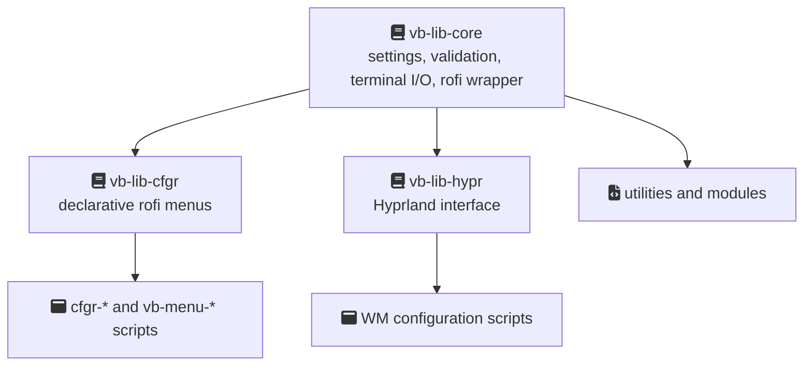
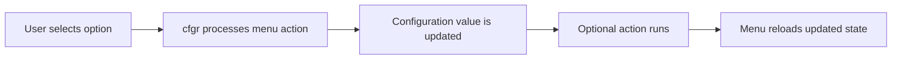

# How Vibranium works

This page explains the basic architecture of Vibranium and how its components interact.

## Overview

Vibranium is a configuration and automation layer built around Hyprland and other desktop tools.

It is not a desktop environment and it does not run as a background service. Instead, it provides scripts, libraries, and configuration systems that interact with the existing desktop stack.

The main components are:

- **Scripts** — perform actions such as changing settings, applying themes, or running utilities
- **Libraries** — shared Bash functionality used by scripts
- **Menus** — interface for changing settings
- **Custom Waybar modules** — provide status information through JSON output
- **Hyprland integration** — manages compositor-related configuration

## Runtime model

Vibranium is event-driven. There is no permanent Vibranium daemon running in the background.

The general flow is:

```text
keybinding or menu action
          ↓
    Vibranium script
          ↓
     action performed
          ↓
        exit
```

Most operations only run when requested.

## Library structure

Most scripts use a shared library stack:



### `vb-lib-core`

Provides common functionality:

- Settings access and validation.
- Theme variable loading.
- Terminal output helpers.
- Rofi integration.
- Logging utilities.
- Common desktop helpers.

### `vb-lib-cfgr`

Provides the configuration menu framework.

Scripts describe available options, and the library handles:

- Menu generation.
- User interaction.
- Updating configuration values.

### `vb-lib-hypr`

Provides Hyprland-specific functionality:

- Reading compositor state.
- Writing Hyprland configuration values.
- Handling grouped Hyprland operations.

## Configuration flow

Changing a setting through a menu follows this process:



Settings are stored as simple configuration values and validated when loaded.

The detailed implementation is covered in:

- [The cfgr menu system](configuration-system.md)
- [Settings & validation](settings.md)

## Theme system

Themes are generated rather than simply applied as static files.

The process is:

```text
Theme selection
      ↓
Generate application configurations
      ↓
Apply user overrides
      ↓
Update wallpaper and runtime appearance
```

A single theme palette is used to generate configurations for supported applications, keeping the desktop appearance consistent.

See [Themes](themes.md).

## Runtime directories

Vibranium follows the [XDG Base Directory](https://specifications.freedesktop.org/basedir/latest/) specification:

| Location                      | Purpose                             |
| ----------------------------- | ----------------------------------- |
| `~/.config/vibranium/`        | User configuration and active theme |
| `~/.local/state/vibranium/`   | Persistent state and backups        |
| `~/.cache/vibranium/`         | Temporary data and logs             |
| `$XDG_RUNTIME_DIR/vibranium/` | Session-only runtime files          |
| `~/.local/share/vibranium/`   | Vibranium installation files        |

The installation directory is managed separately and updated only through Vibranium update operations.

## What Vibranium does not do

Vibranium does not:

- Replace Hyprland's configuration system.
- Manage every application configuration.
- Hide the underlying system tools.
- Replace tools such as `pacman`, `hyprctl`, or `wpctl`.

Vibranium is an additional configuration layer built on top of existing Linux tools.
