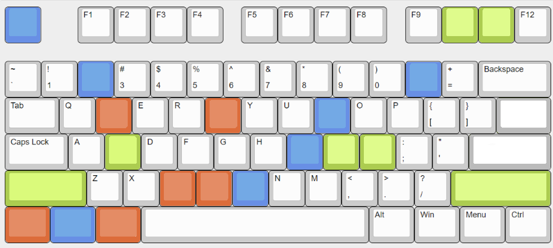
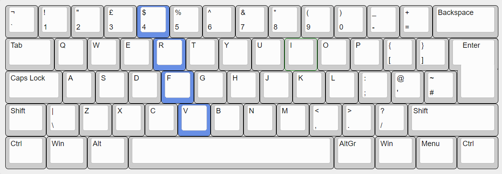

# Introduction

If you’ve been using a WM for a long time, you’re probably already used to your own keyboard shortcuts. Adjusting to new ones may feel a bit inconvenient at first.

Let’s take a look at the diagram, which shows examples of several shortcuts.

Where:

- **Blue** — the main modifier, aka `SUPER` or the `Windows` key  
- **Green** — an auxiliary key used with the main modifier  
- **Orange** — the `CTRL ALT` combination for actions  

Vibranium aims to minimize mouse usage as much as possible. For example, there is no Waybar icon to open the app launcher.

For basic window management, the layout is inspired by Vim navigation, with a slight twist. To make it easier to understand, imagine moving `W`, `A`, `S`, `D` (or the arrow keys) to the right side of the keyboard and renaming them to `I`, `J`, `K`, `L`.

Key combinations in Vibranium are designed to minimize hand movement for non-standard actions. For example, to open the Utilities menu, you hold `CTRL` and `ALT` (orange) with your left hand and press `U` with your right. Your left hand barely moves, acting as a stable modifier.

Alternatively, you can think of the keyboard as split into two areas:

  
yes, it’s ISO layout now, sorry

The left hand is responsible for the left side, and the right hand for the right side.

## Philosophy

The goal is simple: keep things both simple and intuitive. There are no awkward combinations like `SUPER CTRL SHIFT SPACE` just to perform a single action.

Some examples:

- Choose a **[T]**heme: `CTRL ALT T`  
- Open **[U]**tilities: `CTRL ALT U`  
- Change **[W]**allpaper: `CTRL ALT W`  
- Open **[P]**assword manager: `CTRL ALT P`  
- Toggle **[F]**ullscreen: `SUPER F`  
- Toggle clipboard: `SUPER V`  
- Clear clipboard: `SUPER SHIFT V`  
- **[M]**ute mic: `SUPER M` (hardware keys also work)  

Each key intuitively represents the action it performs.

Some shortcuts, like `SUPER V`, are borrowed from other environments and operating systems to maintain familiarity. For example, taking a screenshot of a selected area uses the familiar `SUPER SHIFT S`, which is the default in KDE, GNOME, and Windows. To open the power menu, use `CTRL ALT DELETE`.

### Summary

`SUPER` and `SUPER SHIFT` are used for essential tasks such as window and workspace management, app launching, screenshots, clipboard operations, and hardware controls like volume and microphone. These are the core actions you’re likely to use across any OS.

“Additional” tasks are prefixed with `CTRL ALT`. These are typically custom actions, such as opening menus or running background scripts. For example:

- Open **[R]**ecording menu: `CTRL ALT R`  
- Open **[C]**olor picker: `CTRL ALT C`  
- Open **[U]**tilities menu: `CTRL ALT U`  
- (Un)**[F]**reeze PID: `CTRL ALT F`  

You can find a full list of keybindings in **Vibranium Menu** -> **Help** -> **Keybindings***.

---

Related pages:
- [Manage Keyboard Layouts](Manage%20Keyboard%20Layouts.md)
- [Customize Keybindings](Customize%20Keybindings.md)