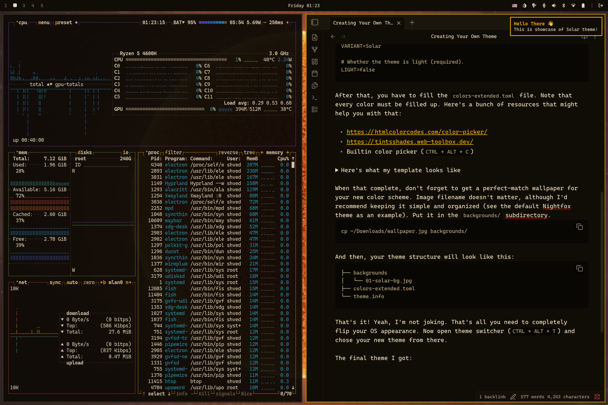
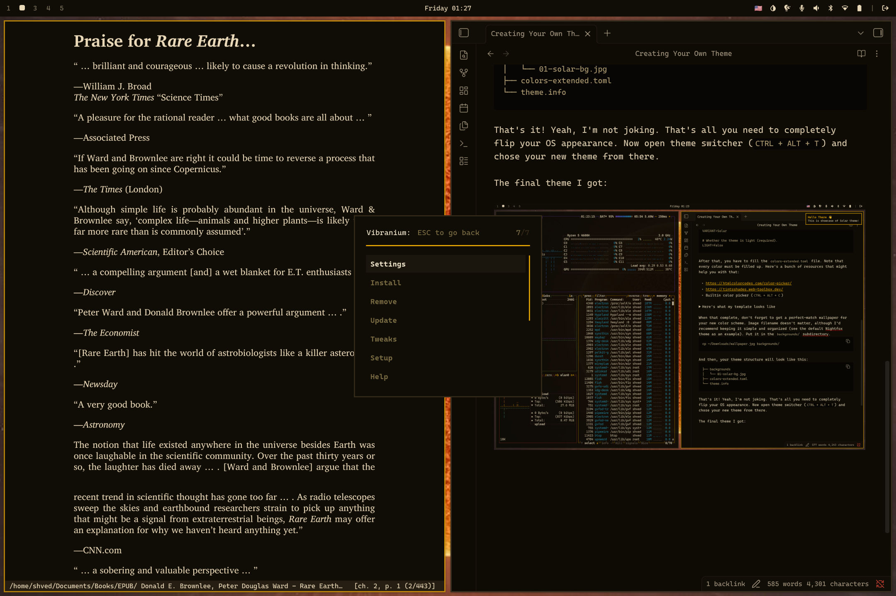

# Overview

Thanks to the wide range of color in the `color-extended.toml` (explained in [Themes Architecture](Themes%20Architecture.md)), you can create themes by filling up only single file, and I'm not even joking right now. On this page, I'll walk you through on how to create your own theme from scratch, using both template-only and traditional methods.

## Template-only method

<details>

<summary>Click here to see empty template file</summary>

```
black_dim = ""
black = ""
black_bright = ""

red_dim = ""
red = ""
red_bright = ""

pink_dim = ""
pink = ""
pink_bright = ""

green_dim = ""
green = ""
green_bright = ""

yellow_dim = ""
yellow = ""
yellow_bright = ""

orange_dim = ""
orange = ""
orange_bright = ""

blue_dim = ""
blue = ""
blue_bright = ""

purple_dim = ""
purple = ""
purple_bright = ""

cyan_dim = ""
cyan = ""
cyan_bright = ""

white_dim = ""
white = ""
white_bright = ""

gray_dim = ""
gray = ""
gray_bright = ""

accent_dim = ""
accent = ""
accent_bright = ""

background_h = ""
background_0 = ""
background_1 = ""
background_2 = ""
background_3 = ""
background_4 = ""
background_5 = ""

foreground_h = ""
foreground_0 = ""
foreground_1 = ""
foreground_2 = ""
foreground_3 = ""
foreground_4 = ""
```

</details>

To create a template-based only theme, ideally you'll need only three components:

- A filled up `colors-extended.toml`
- A properly formatted `theme.info`
- At least one background image in `backgrounds/`


First, create a theme folder in `~/.config/vibranium/themes/`:
```bash
# ccd is a custom command provided by Vibranium's fish shell config
# that creates a directory and immediately enters it.
ccd ~/.config/vibranium/themes/solar
```

Then, you'll need to write down theme's metadata in `theme.info` file in theme's root folder:
```
# Theme family name.
# This value is used as a menu entry in the theme switcher (CTRL + ALT + T).
# Leave empty if the theme is standalone.
FAMILY=

# Theme variant name (required).
# For standalone themes, this value is used as the theme name.
VARIANT=Solar

# Whether the theme is light (required).
LIGHT=false
```

After that, fill in colors-extended.toml. Every color value must be defined. Useful resources:
- https://htmlcolorcodes.com/color-picker/
- https://tintsshades.web-toolbox.dev/
- Builtin color picker (`CTRL + ALT + C`)

<details>

<summary>Here's what my template looks like</summary>

```
black_dim = "#1C1710"
black = "#2C2418"
black_bright = "#403520"

red_dim = "#8C2E1C"
red = "#C44030"
red_bright = "#E85C42"

pink_dim = "#7A2845"
pink = "#B84068"
pink_bright = "#E05888"

green_dim = "#4A6828"
green = "#6E9040"
green_bright = "#96BC58"

yellow_dim = "#AA8000"
yellow = "#E8B800"
yellow_bright = "#FFD840"

orange_dim = "#B05A14"
orange = "#E88020"
orange_bright = "#FFA840"

blue_dim = "#1E3C70"
blue = "#2E60AE"
blue_bright = "#4A88D8"

purple_dim = "#4C2278"
purple = "#7040B0"
purple_bright = "#9C60D8"

cyan_dim = "#1A6478"
cyan = "#2894B0"
cyan_bright = "#3CC0D0"

white_dim = "#A09080"
white = "#D8C8A8"
white_bright = "#F0E4C8"

gray_dim = "#3C3028"
gray = "#6A5C4C"
gray_bright = "#9C8C7A"

accent_dim = "#9C7000"
accent = "#E8A800"
accent_bright = "#FFCC00"

background_h = "#090704"
background_0 = "#100C06"
background_1 = "#1A150D"
background_2 = "#261E13"
background_3 = "#352A1A"
background_4 = "#4C3C24"
background_5 = "#634F30"

foreground_h = "#F5EAD0"
foreground_0 = "#EAD9B8"
foreground_1 = "#D4C098"
foreground_2 = "#B8A478"
foreground_3 = "#9A8858"
foreground_4 = "#7A6C42"
```

</details>

Once that’s done, don't forget to pick a wallpaper that matches your color scheme. The filename doesn't matter, but keeping it simple and organized is recommended (see the default *Nightfox* theme for reference). Place it in the `backgrounds/` directory:

```bash
cp ~/Downloads/wallpaper.jpg backgrounds/
```

Your theme structure should now look like this:

```
├── backgrounds
│   └── 01-solar-bg.jpg
├── colors-extended.toml
└── theme.info
```

That's it. Seriously. That’s all it takes to completely transform your system’s appearance.

Now open the theme switcher (`CTRL + ALT + T`) and select your new theme.

One important detail: the quality of the result depends directly on the quality of your input. The more carefully tuned your colors are in the template file, the better the final theme will look. Good examples of this are *Ristretto* and *Deep Forest* themes.

<details>

<summary>Result</summary>





</details>

## Traditional method

In the traditional method, you still need to fill out the template file. This is required because Vibranium generates theme templates for *Qt* and *GTK*, as well as applications like Obsidian.

In addition to the template file, you manually adjust configuration for each application to ensure perfect color matching. This is the older approach, but it can produce higher-quality results compared to the template-based method.

The process starts the same way: create a theme folder, define metadata, and fill in the template.

A good example of this approach is the [default theme](https://github.com/shvedes/vibranium/tree/master/themes/nightfox-nightfox). Its structure shows how a fully manual theme is organized.