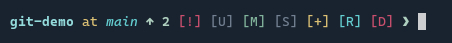

During installation, you’ll be asked which shell you use.
Vibranium provides three popular options: `bash`, `zsh`, and `fish`, all with largely similar configurations.

Keep in mind that shells are not identical. A feature that works in `bash` or `zsh` may not work in `fish`, for example. That said, all three configurations aim for feature parity as much as possible.

Each shell configuration includes a set of small but useful functions such as `extract`, `backup`, `ccd`, and more. To see the full list, run `flist` in the terminal. It will display function names along with brief descriptions.

## Prompt

To simplify maintenance across all three shells, Vibranium uses [Starship](https://starship.rs/) as the prompt generator. It uses the `toml` format for configuration. For the full config, see `~/.config/starship.toml`. As always, you can customize it to your liking (see [Overriding Default Configs](Overriding%20Default%20Configs.md)).

### GIT Module

The Git module uses minimal glyphs (Nerd Fonts), keeping most of the status output as plain text with color formatting.

| Indicator    | Symbol    |
| ------------ | --------- |
| `conflicted` | `[!]`     |
| `untracked`  | `[U]`     |
| `modified`   | `[M]`     |
| `stashed`    | `[S]`     |
| `staged`     | `[+]`     |
| `renamed`    | `[R]`     |
| `deleted`    | `[D]`     |
| `ahead`      | `↑ N`     |
| `behind`     | `↓ N`     |
| `diverged`   | `↑ N ↓ M` |

### SUDO Module

When you use `sudo`, Linux caches your password for a short period so you don’t have to re-enter it for every command. The SUDO module displays `[!!]` at the far left while the password is cached and disappears once the cache expires.

### Hostname

By default, the hostname is not shown, since you already know your machine. However, when you connect to Vibranium via SSH, it becomes visible.

### Python Venv

> [!NOTE]
> You can create and activate Python virtual environments using the `mkvenv` command.

A simple indicator appears when a Python virtual environment is active.

### Command Duration

If a command takes more than one second to complete, its execution time is displayed on the far right.
