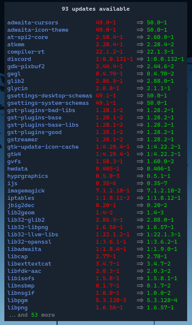

As the title suggests, Vibranium uses [Waybar](https://github.com/Alexays/Waybar) as its bar implementation. While it provides preconfigured built-in modules (see [Overriding Default Configs](Overriding%20Default%20Configs.md)), Vibranium also includes a number of custom modules that integrate closely with the rest of the runtime.

This includes state-based modules that show or hide themselves based on specific events. For example, the [timer](https://github.com/shvedes/vibranium/blob/master/config/waybar/modules/custom-timer.jsonc) module.

Vibranium also features interactive modules that you can actively use. Examples include the [color picker](https://github.com/shvedes/vibranium/blob/master/config/waybar/modules/custom-color-picker.jsonc) and [updates](https://github.com/shvedes/vibranium/blob/master/config/waybar/modules/custom-pacman.jsonc).

If you want to customize anything, you can do so in `~/.config/waybar`. To toggle modules on and off, go to *Vibranium Menu* → *Settings* → *Waybar* → *Toggle Modules*:

If you delete module files or remove options from Waybar’s `config.jsonc`, Vibranium will detect the changes and hide the corresponding entries from the settings menu.

Some modules depend on external CLI tools. If one of these tools is not available (for example, it was removed by mistake), the next automatic module update (or Waybar restart) will notify you about it:

## Weather module

When you enable the [weather](https://github.com/shvedes/vibranium/blob/master/config/waybar/modules/custom-weather.jsonc) module for the first time, Vibranium will detect it and attempt to fetch [ip-api.com](http://ip-api.com) to determine your location based on your IP address.

At the time of writing, changing the city for weather tracking is not available through the Vibranium settings UI. To do this, you need to manually edit `~/.config/vibranium/settings`, then reload the configuration using `CTRL ALT U`.

## Updates module

Vibranium includes the [updates](https://github.com/shvedes/vibranium/blob/master/config/waybar/modules/custom-pacman.jsonc) module, which, when enabled, fetches available Arch and AUR updates and displays the number of pending updates in the bar next to the icon. A more detailed breakdown is shown in the tooltip:

When the number of available updates exceeds 125 packages (combined Arch and AUR), a reminder notification is triggered to emphasize the importance of regularly updating Arch Linux (see [Project Philosophy](Project%20Philosophy.md)). This notification appears even if the module itself is disabled.